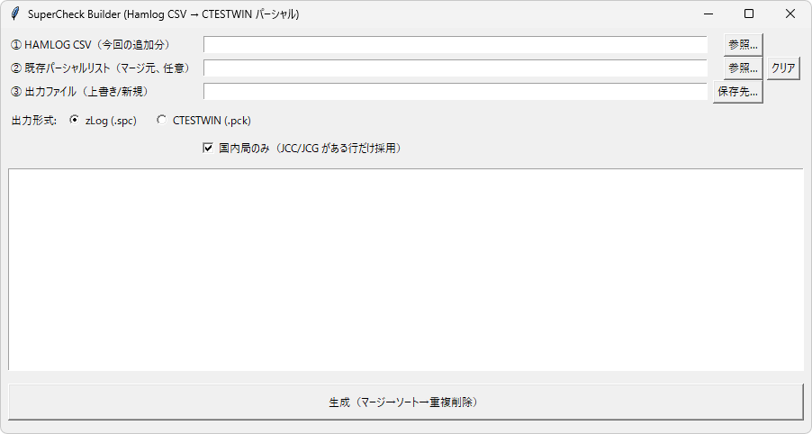

# SuperCheck Builder（Turbo HAMLOG CSV → スーパー・チェック）

[](https://github.com/jp1lrt/hamlog-supercheck-builder/releases/latest) [](https://github.com/jp1lrt/hamlog-supercheck-builder/releases/latest) [](LICENSE)

---
## ダウンロード（Windows 実行ファイル）

最新版の `supercheck_builder.exe` は GitHub Releases からダウンロードしてください：  
https://github.com/jp1lrt/hamlog-supercheck-builder/releases/latest

---

## 重要：拡張子（.spc / .pck）について

このツールは **.spc（zLog）** と **.pck（CTESTWIN）** のどちらでも出力できます。

また、運用上のポイントとして：

**「.spc で出力したファイルは、拡張子を .pck にリネームして CTESTWIN で使用できます」**

例：  
`TEST.spc` → `TEST.pck`

---

## 特徴

- Turbo HAMLOG の CSV から **国内局（JCC/JCG が入っている行）** を抽出（設定で OFF も可）
- 既存のパーシャルリスト（任意）と **マージ**
- コールサインで **ソート**
- マージ方式を GUI で選択可能  
  - **上書き（CSV優先）**  
  - **追加（既存優先：空欄のみ補完）**  
  - **併記（既存＋CSV）**：同一コールでも **複数 QTH を複数行で出力**
- 既存の不完全行（CALLのみ／都道府県2桁のみ）を整理（設定で ON/OFF 可）  
  - CSVに完全情報があれば補完、なければ削除
- 詳細優先クリーンアップ（設定で ON/OFF 可）  
  - 例：`09003` と `09003J` なら **後者を優先**（より詳細）  
  - 完全な JCC/JCG があれば **都道府県2桁の行は削除**
- 上書き時、**既存の方が詳細なら既存を残す**（例：`29012A` を保護）（設定で ON/OFF 可）
- マージ結果のレポート TXT を出力可能（任意）
- GUI（tkinter）で直感的に操作可能
- Windows用の単体 `.exe` を Releases で配布


---

## 前提条件
- 実行ファイルを使う場合: Windows（.exe をダブルクリックで実行可能）  
- ソースから実行する場合（開発者向け）:
  - Python 3.9 以上（3.14 など新しいバージョンでも動作確認済み）  
  - tkinter（GUI を使う場合）
  - 推奨: 仮想環境（venv）

---

## ダウンロード（Windows）
最新版の Windows 実行ファイルは GitHub Releases からダウンロードしてください：  
[最新版をダウンロードする](https://github.com/jp1lrt/hamlog-supercheck-builder/releases/latest)

配布ファイル（リリース）にはビルドのトレーサビリティ情報（ビルド元コミット、SHA256、ビルド日時）をリリースノートに記載しています。

---

## 入力（Turbo HAMLOG CSV）について

- 入力は **Turbo HAMLOG が出力した CSV** を想定しています
- 国内局は **JCC/JCG コード** が含まれる行だけ採用します（例：`1304` / `47003G` など）
- 海外局など **JCC/JCG が無い行** は（設定により）除外できます  
  ※もし取り切れないケースがあっても、最終的に海外局は手動で削除する運用でもOKです
---


## 使い方（GUI）
1. Releases からダウンロードした `supercheck_builder.exe` をダブルクリックして起動します。  
2. GUI 上で Turbo HAMLOG の CSV ファイルを選択します。  
3. 出力形式（.spc / .pck 等）や保存先を選択して「生成」ボタンを押します。  
4. 出力ファイルが指定したフォルダに作成されます。

（GUI の詳細な操作手順やスクリーンショットは今後 README に追記します）

---

## 使い方（CLI）
ソースから直接実行する場合の例（簡易CLI）：

```bash
python supercheck_builder.py <hamlog.csv> <existing.spc_or_pck_or_txt_or_empty_or-> <out.spc_or_pck_or_auto>

# 既存リストを指定して出力（.spc / .pck は拡張子で判別）
python supercheck_builder.py hamlog.csv existing.pck out.pck

# 既存リストなし（新規作成）
python supercheck_builder.py hamlog.csv - out.spc

# 出力を自動生成（CSV名に .spc を付ける）
python supercheck_builder.py hamlog.csv existing.pck auto

# 出力を自動生成（CSV名に .pck を付ける）
python supercheck_builder.py hamlog.csv existing.pck auto.pck

```

2. ヘルプ表示（例）
```bash
python supercheck_builder.py --help
```

3. バッチ実行の例（入力 CSV → 出力ファイル指定）
```bash
python supercheck_builder.py --input input.csv --output out.spc --format spc
```

（実際の CLI オプションはスクリプトの `--help` を参照してください）

---

## 簡単な検証手順（ダウンロード直後に推奨）

ダウンロード直後に次の手順でファイルの整合性を確認してください。

1. ファイル名を確認します（例: `supercheck_builder.exe`）。  
2. SHA256 を計算し、リリースページまたは添付の `.sha256` ファイルに記載されたハッシュ値と照合します。

Windows（PowerShell / CMD）:
```powershell
certutil -hashfile supercheck_builder.exe SHA256
```

Linux / macOS / Git Bash:
```bash
shasum -a 256 supercheck_builder.exe
```

`.sha256` ファイルを一緒にダウンロードした場合（自動照合）
```bash
shasum -a 256 -c supercheck_builder.exe.sha256
# -> 出力例: "supercheck_builder.exe: OK" が表示されれば一致
```

補足
- ハッシュがリリースページにある「配布ファイル SHA256」と一致すれば、配布ファイルは改ざんされていないと判断できます。  
- `.sha256` の中身は通常「<SHA256>  <ファイル名>」の一行形式です（スペースは1つでも2つでも問題ありません）。  
- Windows の場合、SmartScreen 等で警告が出ることがありますが、ファイルのハッシュが一致していればビルド元と同一であることが確認できます。警告の扱いについて不明な点があればサポートします。

---

## ソースからのビルド（開発者向け）
PyInstaller を使って Windows 用の単一 exe を作成できます（Windows 上で実行してください）。

1. 仮想環境を作る・有効化して依存をインストール
```bash
python -m venv venv
.\venv\Scripts\activate     # PowerShell の場合
pip install -r requirements.txt
pip install pyinstaller
```

2. ビルド実行（例）
```bash
pyinstaller --onefile --windowed supercheck_builder.py
```

3. 出力は `dist/supercheck_builder.exe` に生成されます。生成後は SHA256 を取得し、リリースに添付してください。

---

## ビルドメタ情報の記録
配布のトレーサビリティを確保するため、ビルドごとに次の情報を保存しておくことを推奨します：
- ビルド元コミット（短縮コミット ID）  
- 実行ファイルの SHA256  
- ビルド日時（UTC）

例: `dist/build_info.txt`
```
commit: 96605c7
sha256: 8e5007908832703ec9d6f4019cc44e9387b8ae7a55b5bd469e82ac0a3e000ab3
built: 2025-12-29T09:35:17Z
```

リリース作成時には、上の情報をリリースノートに記載し、実行ファイルを添付してください。

---

## 貢献・報告
バグ報告や機能要望は GitHub Issues で受け付けています。プルリクエスト歓迎。  
貢献の際はできるだけ小さな変更単位で、変更点を明記して送ってください。

---

## 著者 / 連絡先
津久浦 慶治 (Yoshiharu Tsukuura) — コールサイン: JP1LRT  
GitHub: https://github.com/jp1lrt

---

## ライセンス
このプロジェクトは MIT License のもとで公開されています。詳しくは `LICENSE` ファイルを参照してください。

---

## 連絡
問題や質問があれば Issues を開いてください。リリースや配布に関する重要な変更はリリースノートにて告知します。
